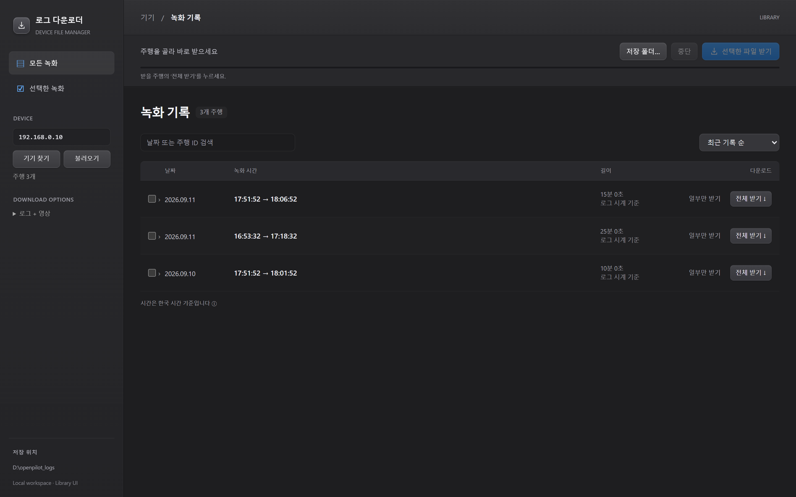
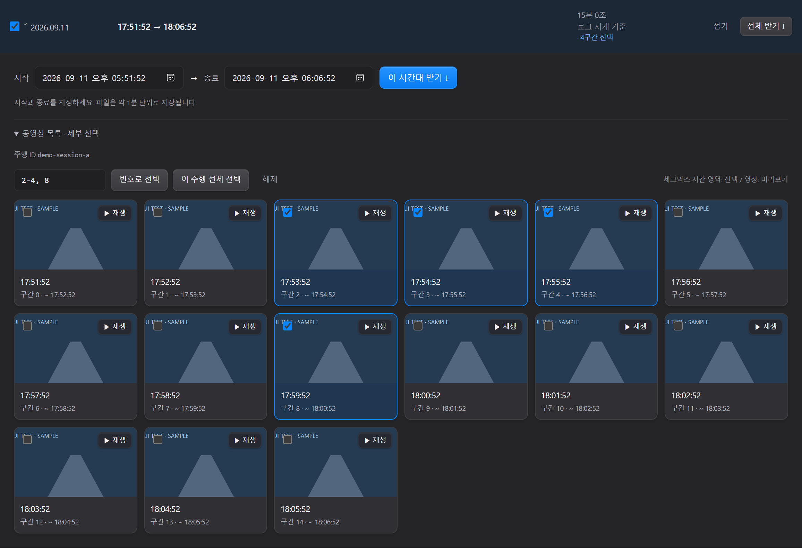
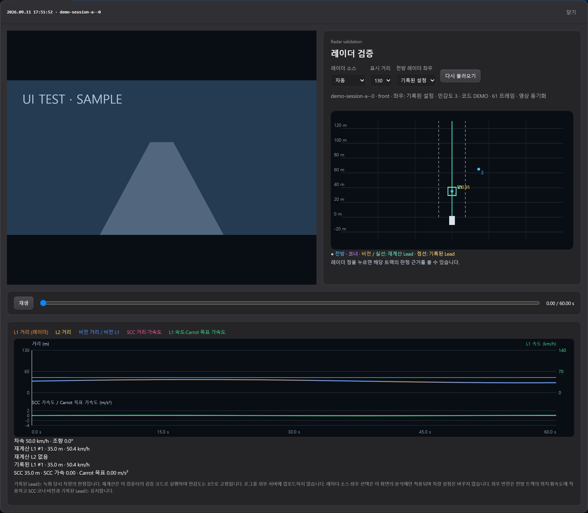
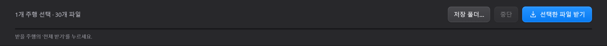
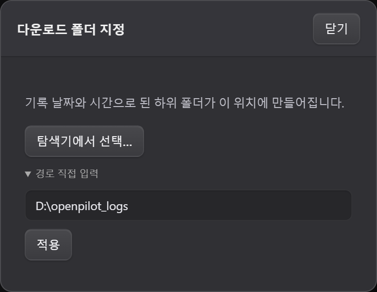
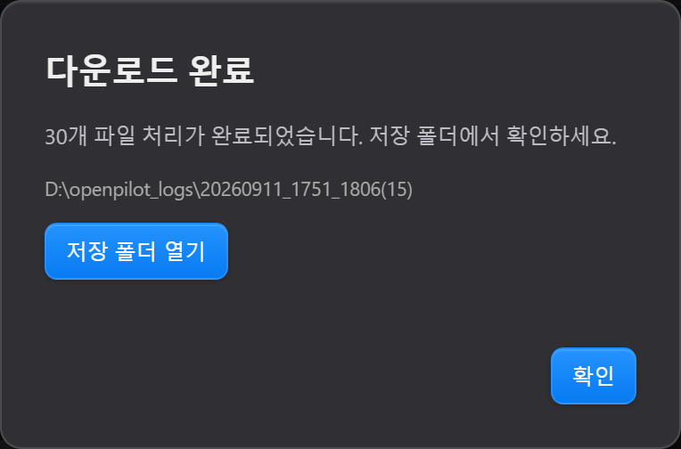

# 로그 다운로더

콤마 기기의 녹화 영상과 로그를 날짜·시간으로 찾아 PC에 저장하는 Windows 프로그램입니다.

## [⬇ Windows용 프로그램 다운로드](https://github.com/joongyu01/openpilot-log-downloader/releases/latest/download/OpenpilotLogDownloader-Windows-x64.zip)

**Python 설치 없이 실행할 수 있습니다. Windows 10/11 64비트용입니다.**

### 처음 사용하는 분

1. 위의 **Windows용 프로그램 다운로드**를 누릅니다.
2. 받은 ZIP 파일을 우클릭하고 **모두 압축 풀기**를 누릅니다.
3. 압축을 푼 폴더에서 **`LogDownloader.bat`를 더블클릭**합니다.
4. 브라우저가 열리면 **기기 찾기**를 누릅니다. PC와 콤마는 같은 네트워크에 연결해 주세요.
5. **저장 폴더…**로 저장할 곳을 정하고, 원하는 녹화의 **전체 받기**를 누릅니다.

ZIP 안에서 바로 실행하지 말고 폴더 전체를 압축 해제해 주세요. 실행 중에는 검은 실행 창을 열어 두세요.

**[화면으로 보는 사용설명서 다운로드 (PowerPoint, 12쪽)](https://github.com/joongyu01/openpilot-log-downloader/releases/latest/download/User-Guide.pptx)**

브라우저가 자동으로 열리지 않으면 [프로그램 열기](http://127.0.0.1:8778/)를 누르세요. 먼저 `LogDownloader.bat`가 실행 중이어야 합니다.

## 화면으로 따라 하기

아래는 프로그램의 실제 화면을 예시 데이터로 실행해 캡처한 것입니다. IP, 날짜, 영상 그림, 레이더 수치는 설명용이며 실제 주행 기록이 아닙니다. 이미지를 누르면 크게 볼 수 있습니다.

### 1. 기기를 연결하고 녹화 찾기

PC와 콤마를 같은 네트워크에 연결하고 왼쪽 **기기 찾기**를 누르세요. IP를 알고 있다면 직접 입력한 뒤 **불러오기**를 누르면 됩니다. 날짜·녹화 시간으로 원하는 기록을 찾으세요. 목록은 준비되는 순서대로 나타납니다.



### 2. 녹화를 눌러 영상 목록 펼치기

**날짜나 녹화 시간 행**을 누르면 바로 아래에 약 1분 단위 영상이 펼쳐집니다. **전체 받기**는 해당 녹화 전체를 저장합니다. 일부만 받으려면 영상의 체크박스를 선택하세요. 번호 입력란에 `2-4, 8`을 넣고 **번호로 선택**을 누르면 2·3·4·8번 구간을 선택합니다.



### 3. 영상과 레이더 함께 확인하기

영상 이미지나 **▶ 재생**을 누르면 영상 옆에 레이더 검증 화면이 열립니다. 아래 재생 버튼과 막대로 확인할 시점을 이동할 수 있습니다. 레이더 점을 누르면 해당 트랙의 판정 근거를 확인합니다. 첫 분석은 로그를 읽고 계산하므로 잠시 걸릴 수 있습니다.



왼쪽 그림은 안내용 영상 대체 이미지입니다. 실제 사용 시 해당 구간의 녹화 영상이 나옵니다. 레이더 데이터가 없는 로그에는 분석 불가 안내가 표시됩니다. 분석은 PC에서 수행하며 로그를 외부 서버에 업로드하지 않습니다.

### 4. 원하는 시간대 또는 선택한 구간 받기

**시작·종료**를 입력하고 **이 시간대 받기**를 누르면 그 시간과 겹치는 구간 파일을 받습니다. 영상을 초 단위로 잘라 저장하는 기능은 아니며, 약 1분 단위 파일로 저장합니다.


체크박스로 골랐다면 화면 상단의 **선택한 파일 받기**를 누르세요. 진행률도 상단에서 확인하며, 멈추려면 **중단**을 누릅니다. 기본은 상세 로그(rlog)와 영상(qcamera)을 함께 받습니다. 왼쪽 **로그 + 영상**에서 파일 종류를 변경할 수 있습니다.



### 5. 저장할 폴더 정하기

다운로드 전에 상단 **저장 폴더…**를 누르고 **탐색기에서 선택…**으로 원하는 위치를 고르세요. 경로를 직접 입력하고 **적용**해도 됩니다. 선택한 위치는 다음 실행에도 유지합니다.



### 6. 완료 확인하고 탐색기로 열기

작업이 끝나면 **다운로드 완료** 팝업이 뜹니다. **저장 폴더 열기**를 누르면 받은 파일이 있는 폴더가 Windows 탐색기로 열립니다. 닫은 뒤에도 상단 **최근 다운로드**에서 결과를 다시 볼 수 있습니다. 일부 실패나 중단은 완료와 구분해서 표시합니다.



이 예시는 15개 구간의 로그와 영상을 함께 받아 **30개 파일**입니다. 폴더 이름의 **(15)**는 파일 수가 아니라 구간 수입니다.

## 저장 폴더

기본 위치는 압축을 푼 폴더 안의 `downloads`입니다. 상단 **저장 폴더…**에서 변경하면 다음 실행에도 유지합니다.

```text
downloads/
└─ 20260911_1751_1806(15)/
```

`20260911`은 기록 날짜, `1751_1806`은 선택한 기록의 시작·종료 시각, `(15)`는 선택한 로그 구간 개수입니다. 시간은 한국 시간 기준입니다. 영상과 로그를 함께 받아도 15구간이면 `(15)`입니다.

시각을 확인할 수 없는 기록은 `날짜미확인/세션 ID/`에 저장합니다. 자정을 넘는 경우 폴더 날짜는 시작일을 사용합니다.

## 자주 묻는 질문

**기기를 찾지 못해요.**

기기 전원과 네트워크를 확인하세요. 기기 화면의 IP를 직접 입력하고 **불러오기**를 눌러도 됩니다. Carrot Web의 dashcam API(7000번 포트)를 제공하는 기기가 필요합니다. 모든 openpilot 버전과 호환되는 도구는 아닙니다.

**목록이 한 번에 나오지 않아요.**

로그 내부 시각을 확인한 세션부터 순서대로 표시합니다. 먼저 나타난 녹화부터 확인할 수 있습니다.

**날짜가 미확인으로 나와요.**

정상 시계 정보가 없는 로그는 현재 날짜로 바꾸지 않고 미확인으로 표시합니다. 로그 자체는 받을 수 있습니다.

**다운로드가 중단됐어요.**

연결을 확인하고 같은 범위를 다시 받으세요. 이미 같은 크기로 저장된 파일은 건너뜁니다. 완료한 파일은 중단 후에도 남습니다.

**다운로드는 어디에 올라가나요?**

선택한 PC 폴더에 저장합니다. 녹화 파일을 GitHub나 클라우드로 업로드하는 기능은 없습니다.

## 개발자용 소스 실행

일반 사용자는 위의 Windows ZIP을 받으면 됩니다. 소스로 실행할 때는 Python과 아래 패키지가 필요합니다.

```powershell
python -m pip install -r requirements.txt
python app/server.py
```

날짜 복구용 스키마는 `app/resources`에 포함되어 있습니다. PowerPoint 설명서는 `docs/User-Guide.pptx`에 있습니다.

이 프로젝트는 개인 제작 도구이며 comma.ai 공식 제품이 아닙니다. 포함된 구성 요소의 저작권 고지는 [THIRD_PARTY_NOTICES.md](THIRD_PARTY_NOTICES.md)를 참고하세요.
